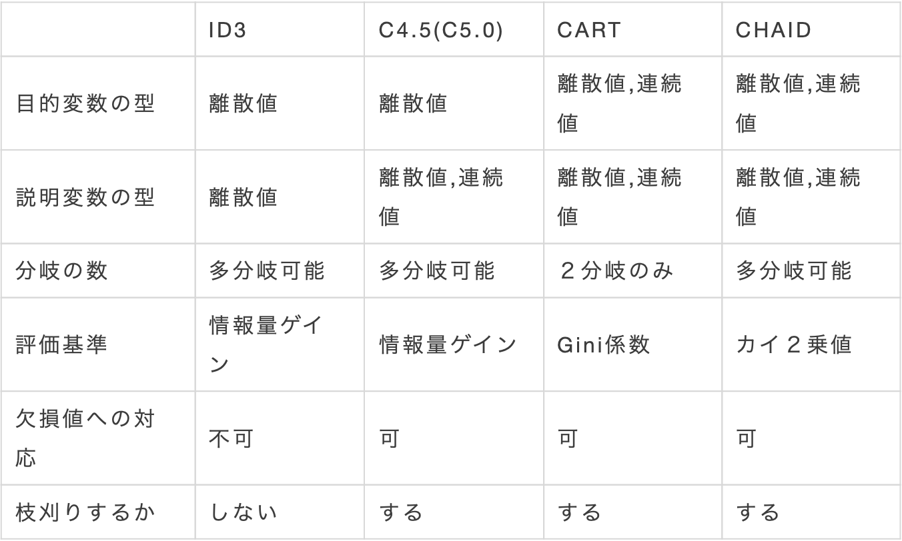

# 決定木(decision-tree)

## CARTの実装  
- 目的：irisデータセットを用いることで，4個の特徴量から花の品種を3クラスに分類する．
- 結果：97.7%の分類精度を出すことができた．
- その他：irisデータセットだけでなく，sklearnのデータセットであれば，ワインの銘柄データセットなどでも適用することができます．
### 引用
- [今更感あるけど決定木について調べたのでまとめる](https://www.st-hakky-blog.com/entry/2018/08/10/080242)